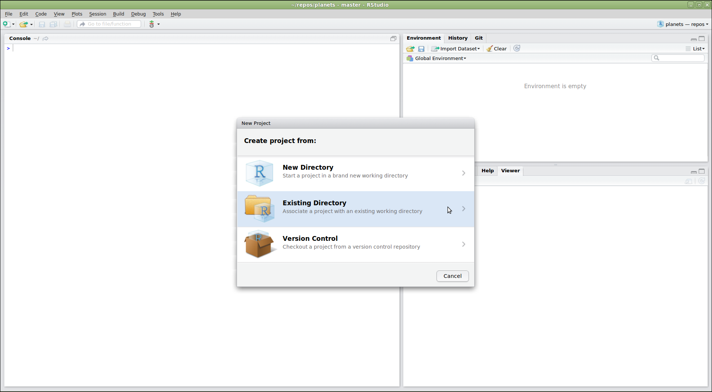
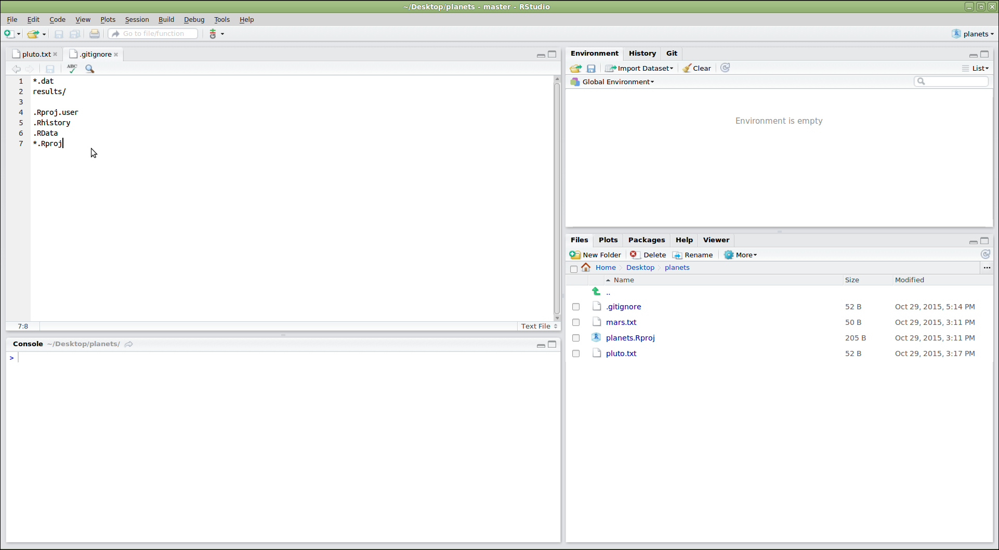

Usar control de versiones es muy útil cuando escribimos scripts, por eso RStudio puede usarse con Git. Hay algunas funcionalidades de Git que solamente se pueden usar desde la terminal, pero RStudio nos dá una rica interface de trabajo para realizar las operaciones más comunes de versión de control.

RStudio te permite crear un proyecto [project][rstudio-projects] asociado con una carpeta. Esta es una manera de mantenerse al tanto de los archivos asociados al proyecto. Una manera de tener control de archivos es mediante el uso del programa de control de versión Git. Para empezar a usar RStudio con control de versión, comencemos por crear un nuevo proyecto: 

Una nueva ventana se abrirá y te preguntará ¿Dónde quieres guardar este proyecto? Tenemos
algunas opciones. Digamos que queremos usar RStudio con el repositorio de los planetas
que ya hemos creado. Como ese repositorio ya está en una carpeta en tu computadora,
podemos escoger la opción "carpeta existente": 

> ## ¿Puedes ver la opción de "Control de versión"?
>
> Aunque no vamos a usar ésta opción aquí, deberías poder ver una opción en el menú que diga
> "Control de versión". Esta es la opción que debes escoger (hacer un click) cuando quieras crear
> un proyecto en tu computadora mediante una clonación de un repositorio de github.
> Si esta opción no es visible, probablemente significa que RStudio no sabe
> donde está tu ejecutable de Git. Mira 
> [esta página](https://stat545-ubc.github.io/git03_rstudio-meet-git.html)
> para encontrar algunos consejos. Incluso después de instalar Git, si estás usando MacOX
> algunas veces puede ser necesario que tengas que aceptar la licencia de XCode
{: .callout}

En el siguiente paso, RStudio va preguntar ¿Cuál es la carpeta existente que quieres usar?. Dale un 
click en "Selecionar" para navegar a la carpeta correcta en tu computadora, luego dale click en 
"Crear proyecto":

Tarán! Ahora tienes un proyecto en R que contiene su propio repositorio. Puedes notar que en el menú ahora aparece un botón de "GIT" en letras verticales. Esto significa que RStudio ha reconocido que ésta carpeta es un repositorio de Git, entonces te dá las herramientas para usar Git:

Para editar los archivos en tu repositorio, puedes dar click en el archivo desde el panel en 
la parte derecha abajo. Ahora, agreguemos más información sobre Pluto:

Ahora que hemos guardado nuestros archivos, podemos usar RStudio to **commit** los cambios. Usa el botón y hazle un clik a "**commit**":

Esto va abrir una ventana donde puedes seleccionar que archivos quieres hacer **commit** (marca
las casillas en la columna "**Staged**") luego escribe un mensaje para el commit (en la parte
superior derecha). Los iconos en la columna de "**Status**" indican el estado actual de cada
archivo. También puedes ver los cambios de cada archivo haciendo un click en su nombre. Una vez
que todo esté de la forma que quieres, dale un click en "**commit**":

Puedes subir los cambios seleccionando "**push**" en el menú de Git. Allí hay
opciones para subir cambios a una versión remota de este repositorio, y ver
la historia de cambios **History**:

> ¿Están los comandos **Push** y **Pull** en gris?
>
> Si éste es el caso, generalmente significa que RStudio no sabe donde están las 
> otras versiones de tu repositorio (por ejemplo, en GitHub).
> Para solucionar esto abre la terminal y ubicate en el repositorio, luego escribe este comando:
> `git push -u origin master`. Luego reinicia RStudio.
{: .callout}

Si le damos un click a la historia de cambios **History**, podemos ver una versión gráfica de lo 
que nos diría el comando `git log`:

RStudio crea algunos archivos que le ayudan a mantener un control de los cambios en el proyecto.
Si tú no quieres guardar cambios de algunos archivos, es una buena idea que 
agregues los nombres de éstos archivos al .gitignore:

Hay muchas más opciones que puedes encontrar en la interface de RStudio, pero
las que aprendíste ahora son suficientes para comenzar.

[rstudio-projects]: https://support.rstudio.com/hc/en-us/articles/200526207-Using-Projects
