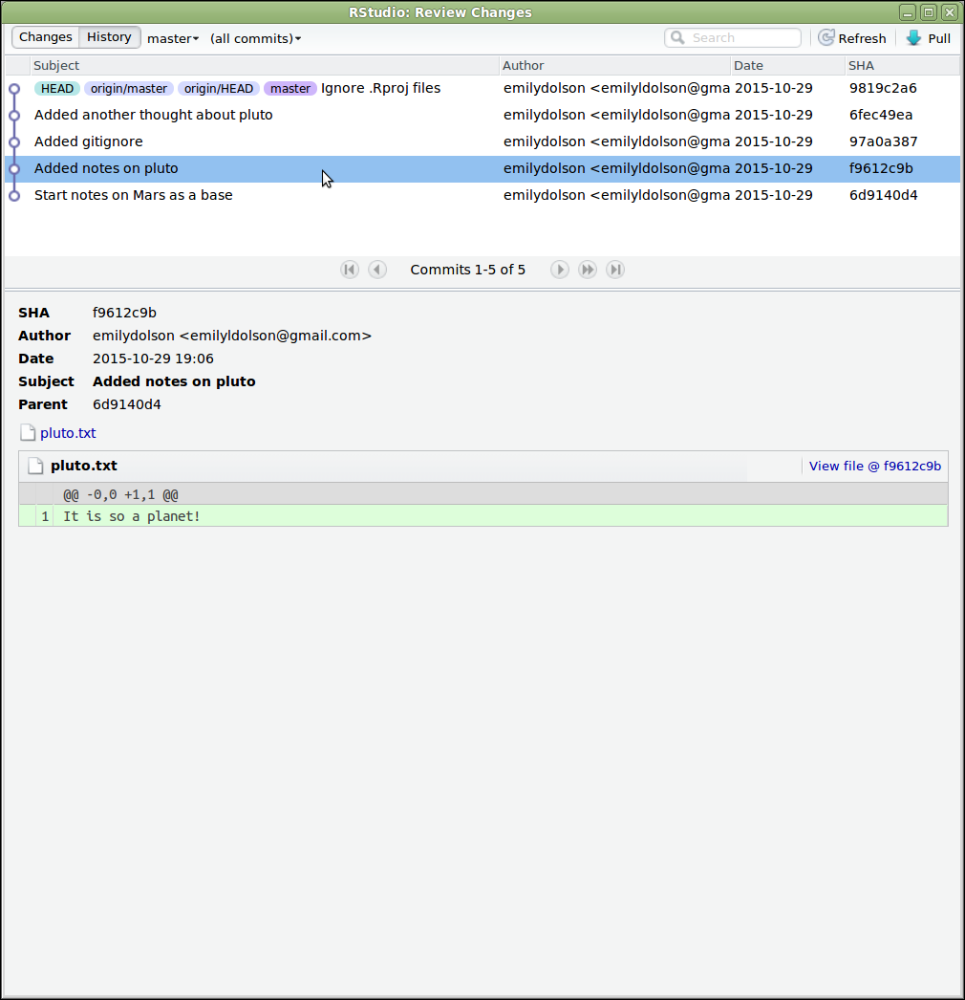

Ya que el uso de control de versiones es muy útil cuando escribimos **scripts**, entonces RStudio esta integrado con Git. Hay algunas otras mas complejas funcionalidades de Git que solamente se pueden usar desde la terminal, pero RStudio tiene una buena interfaz de trabajo para realizar las operaciones más comunes de control de versiones.

RStudio te permite crear un proyecto [project][rstudio-projects] asociado a un directorio determinado. Esta es una manera de hacer un seguimiento de los archivos asociados al proyecto. Una manera de tener control de archivos es mediante el uso de un programa de control de versiones. Para empezar a usar RStudio para el control de versiones, comencemos por crear un nuevo proyecto:


Una nueva ventana se abrirá y preguntará cómo queremos crear el proyecto. Tenemos
aquí varias opciones. Supongamos que queremos usar RStudio con el repositorio de planetas
que ya hemos creado. Como ese repositorio ya está en una carpeta en tu computadora,
podemos escoger la opción "Existing Directory":


> ## ¿Puedes ver la opción de "Version Control"?
>
> Aunque no vamos a usar ésta opción aquí, deberías poder ver una opción en el menú que diga
> "Version Control". Esta es la opción que debes escoger cuando quieras crear
> un proyecto en tu computadora mediante una clonación de un repositorio de GitHub.
> Si esta opción no es visible, probablemente significa que RStudio no sabe
> donde está tu ejecutable de Git. Revisa
> [esta página](https://stat545-ubc.github.io/git03_rstudio-meet-git.html)
> para encontrar algunos consejos. Incluso después de instalar Git, si estás usando MacOSX
> algunas veces puede ser necesario que tengas que aceptar la licencia de XCode
{: .callout}

En el siguiente paso, RStudio va a preguntar cuál es la carpeta existente que queremos usar. Haremos
click en el navegador de archivos para navegar a la carpeta correcta en tu computadora, y luego haremos click en
"Create Project":


¡Y ya está! Ahora tenemos un proyecto en R que contiene tu propio repositorio. Fíjate que ahora en el menú aparece un botón con "Git" en letras verticales. Esto significa que RStudio ha reconocido que ésta carpeta es un repositorio de Git, así que te proporcionará las herramientas para usar Git:


Para editar los archivos en tu repositorio, puedes hacer click en el archivo desde el panel inferior izquierdo. Ahora vamos a añadir más información sobre Plutón:


Una vez que hemos guardado nuestros archivos editados, ahora podemos usar RStudio para hacer permanentes los cambios. Usa el botón y haz clik a "Commit":


Esto abrirá una ventana donde puedes seleccionar qué archivos quieres hacer **commit** (marca
las casillas en la columna "Staged") y luego escribe un mensaje para el **commit** (en el panel
superior derecho). Los iconos en la columna "Status" indican el estado actual de cada
archivo. También puedes ver los cambios de cada archivo haciendo click en su nombre. Una vez
que todo esté de la forma que quieres, haz click en "Commit":


Puedes subir los cambios seleccionando "Push" en el menú de Git. Allí hay también
opciones para traer los cambios (hacer **pull**) desde una versión remota de este repositorio, y ver
el historial de cambios realizados:


> ¿Están los comandos **Push** y **Pull** en gris?
>
> Si este es el caso, generalmente significa que RStudio no sabe dónde están las
> otras versiones de tu repositorio (por ejemplo, en GitHub).
> Para solucionar esto, abre una terminal, sitúate en el repositorio y luego lanza el siguiente comando:
> `git push -u origin master`. Luego reinicia RStudio.
{: .callout}

Si hacemos click en el historial de cambios "History", podemos ver una versión gráfica de lo
que obtendríamos con el comando `git log`:



RStudio crea algunos archivos que le ayudan a mantener un control de los cambios en el proyecto. Normalmente no deseamos que Git los incluya en el control de versiones, así que es una buena idea agregar sus nombres al `.gitignore`:


> ## Tip: Control de versiones del output desechable (versioning disposable output)
>
> Generalmente tu no quieres hacer control de cambios o versiones de tus output desechables  (o solo datos de lectura).
> Entonces, tu debes modificar el archivo `.gitignore` para decirle a Git que ignore estos archivos
> y directorios. 
{: .callout}

> ## Challenge
>
> 1. Crear un directorio dentro de tu proyecto llamado `graphs`.
> 2. Modificar el archivo `.gitignore`  para que contenga `graphs/`
> entonces este output desechable no estara **versioned**.
>
> Agrega el folder recien creado al control de versiones usando la interface de Git.
>
> > ## Solucion del Challenge
> >
> > Esto puede ser realizado con los comandos de linea:
> > ```		
> > $ mkdir graphs		
> > $ echo "graphs/"> > .gitignore		
> > ```		
> > {: . shell}		
> {: .solution}		
{: .challenge}

Hay muchas más opciones que se pueden encontrar en la interfaz de RStudio,
pero las que hemos visto son suficientes para comenzar.

[rstudio-projects]: https://support.rstudio.com/hc/en-us/articles/200526207-Using-Projects


